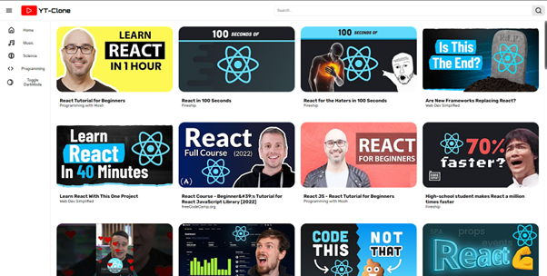
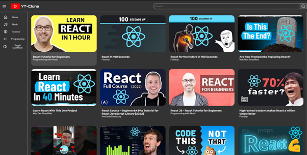
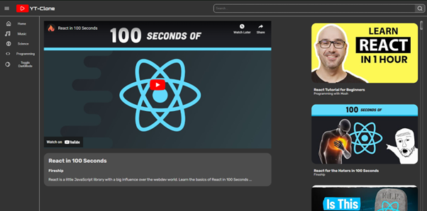

# Yt-clone App

## Description

This is a React based clone of the popular video-sharing platform YouTube using the [YouTube V3 API](https://developers.google.com/youtube/v3). It allows the user to watch videos and search for content, just like the real YouTube.

## Features

- Toggle dark mode: toggle the theme for better user experinece, uses [local storage](https://developer.mozilla.org/en-US/docs/Web/API/Window/localStorage) for storing the status
- Search: searches youtube database using the keyword inserted by the user
- Watch videos: uses an iframe window to display and play the selected video
- Responsive design to adapt to different screen sizes

## Live demo

You can try out the yt-clone by visiting the [live demo](https://yt-clone-jpn.netlify.app)

## How to run the app locally

If you want to run the app localy:

#### 1. Clone the repository

- HTTPS: `git clone https://github.com/Zack1808/yt-clone.git`
- SSH: `git clone git@github.com:Zack1808/yt-clone.git`
- GitHub CLI: `gh repo clone Zack1808/yt-clone`

#### 2. Enter the project directory

`cd yt-clone`

#### 3. Allow the app to install the necessary packages (Node.js has to be installed on the device)

`npm install`

#### 4. Settup the API key

Within the project directory, create the .env file. In there create the variable REACT_APP_YT_API_KEY

`REACT_APP_YT_API_KEY=yourYouTubeV3APIkey`

#### 5. start the app

`npm`

After execution, the localhost server will startup and a browser window will open, previewing the yt-clone app.

## Contribution

Contributions to the Yt-clone project are welcome. If you find any issues or want to add new features, feel free to create a pull request. Make sure to follow the project's coding conventions and provide detailed information about your changes.

## Contact

If you have any questions or suggestions, you can reach me via:

- Mail: jeanpierrenovak23@gmail.com
- My portfolio: [jeanpierrenovak.netlify.app](https://jeanpierrenovak.netlify.app)

---

Happy video watching!
